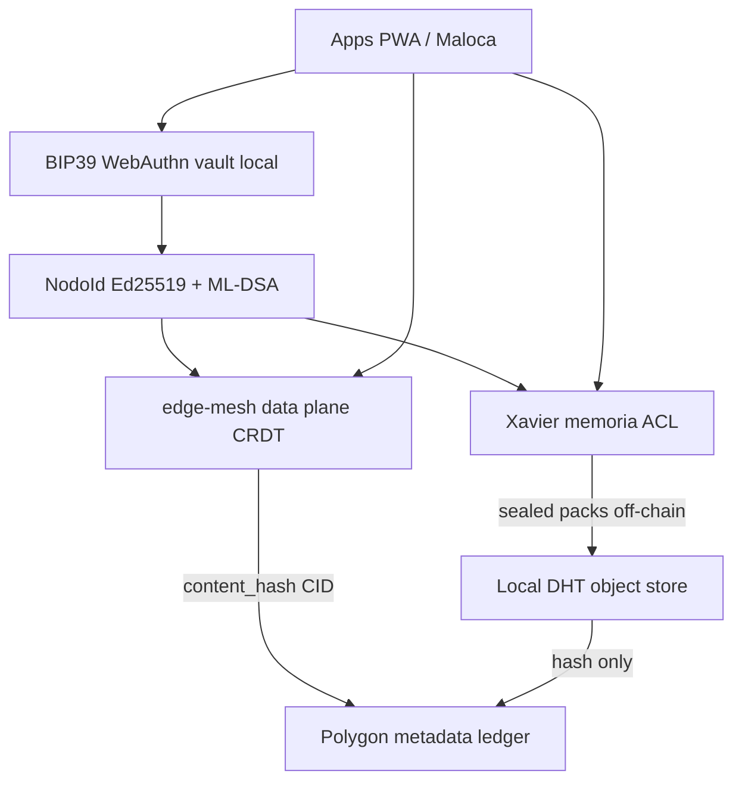

# Login descentralizado SWAL — Plan de features (fases 0–4)

| Campo | Valor |
|-------|--------|
| **ID** | FEAT-SWAL-DECENTRALIZED-LOGIN |
| **Estado** | **Shippable DONE (F0–F3)** · F4 research separado |
| **Fecha** | 2026-07-28 |
| **Plan Cursor** | `login_descentralizado_swal_mesh_a7f3c2e1` |
| **Avances** | [DECENTRALIZED_LOGIN_PROGRESS.md](./DECENTRALIZED_LOGIN_PROGRESS.md) |
| **Siguiente** | **Ops Amoy deploy** (prereq F2) · **Fase 4 research** (DL-F4) · UI WebAuthn Maloca (producto) |
| **Relacionados** | [GOAL.md](./GOAL.md) · [ADR-SWAL-MESH-GOV.md](./ADR-SWAL-MESH-GOV.md) · [AUTH_RECOVERY_SPIKE.md](./AUTH_RECOVERY_SPIKE.md) · [LOGIN_IDENTITY_DESIGN.md](./LOGIN_IDENTITY_DESIGN.md) · [SRS.md](./SRS.md) §2 / §16 · [NODE_PRO_AND_INSTANCES.md](./NODE_PRO_AND_INSTANCES.md) |

---

## 1. Propósito

Documentar el **protocolo de login / identidad descentralizada** alineado al goal SWAL:

- Identidad = nodo (BIP39 / WebAuthn + firmas), no cuenta SaaS central.
- **Pro = nodo activo** (nunca Stripe).
- Mesh = **data plane** (edge-mesh); ledger canónico = **Polygon**.
- On-chain solo metadata/hashes; payloads off-chain.

Este documento es la **fuente de verdad del roadmap de login** para agentes y repos. El diseño técnico vive en [LOGIN_IDENTITY_DESIGN.md](./LOGIN_IDENTITY_DESIGN.md).

---

## 2. No-goals (anti-patrones)

| No-goal | Motivo |
|---------|--------|
| Blockchain interna en edge-mesh / libp2p / mesh-core | ADR fija Polygon; mesh = CRDT/P2P |
| Stripe / suscripción como unlock Pro | GOAL no negociable |
| Datos de negocio en claro on-chain | ADR §2.2 |
| Tres BIP39 concatenados ad hoc | Rompe checksum / no estándar |
| Depender de Pramaana / Z Auth / “Bio-Rollup” como producto | Research / hackathon; no canónico |
| Sustituir Xavier por otro bus de memoria | Un canónico por capa |

---

## 3. Mapa features externas → SWAL

| Feature (conversación / research) | Viabilidad | Fase SWAL | Mapeo |
|-----------------------------------|------------|-----------|--------|
| Seed phrase BIP39 | **Producción** | 0 | AUTH_RECOVERY_SPIKE |
| SLIP39 / Shamir 2-of-3 | **Producción** | 0 | Backup umbral |
| WebAuthn + PIN diario | **Producción** | 0 | Desbloqueo local |
| Challenge ordenado (check-codes) | **Producción** | 0 | Anti-automatización recovery |
| Identidad ML-DSA-65 mesh | **Parcial hoy** | 1 | edge-mesh `identity/` |
| Challenge-response peers | **Parcial hoy** | 1 | edge-mesh signed nonce |
| DID Method completo | **Diseño** | 1–2 | Commitment pubkey + registry Polygon basta día 1 |
| Anclas content_hash / pubkey | **Diseño ADR** | 2 | Polygon Amoy→mainnet |
| PQC híbrido packs (Ed25519+ML-DSA) | **Diseño** | 3 | sealed-pack + edge-mesh |
| ML-KEM encapsulado DEK | **Evaluación** | 3 | crates Rust `ml-kem` |
| Fuzzy extractors biométricos | **Research** | 4 | Helper data local; no template en mesh |
| ZKP biometric (zk-SABER, etc.) | **Research** | 4 | Solo si amenaza concreta |
| Mesh = L1 / consenso BFT | **Rechazado** | — | No-goal |

---

## 4. Repos afectados (por fase)

| Fase | Repos primarios | Rol | Notas |
|------|-----------------|-----|-------|
| **0** | `edge-mesh`, `docs/SWAL`, futuro `@swal/node` / Maloca onboarding | Vault seed, recovery UX | Spike Shamir ya en `spikes/sealed-pack/` |
| **1** | `edge-mesh`, `xavier` (ACL / namespaces) | Login de malla, instance binding | Preferir edge-mesh; `mesh-core` / `gos-p2p-data` = dependency / dominio GOS, no fork de identidad |
| **2** | `gara-g`, `docs/SWAL`, Maloca | Registry Polygon | No L1 propia |
| **3** | `edge-mesh`, `xavier` (sealed packs), spikes | Firmas híbridas + KEM opcional | |
| **4** | Spike aislado + ADR research | Fuzzy / ZKP | No bloquea Pro |

`mesh-core` y `gos-p2p-data` **no** son canónicos de identidad: solo se tocan si un producto GOS/edge lo exige vía edge-mesh.

---

## 5. Fases y criterios de aceptación

### Fase 0 — Login local sin servidor (AUTH_RECOVERY_SPIKE)

**Objetivo:** Crear y recuperar un nodo sin cuenta central.  
**Estado (2026-07-28):** **COMPLETE (shippable).** Crypto + CLI + persist + brick UX + `device_key` CLI hook.

| ID feature | Nombre | Criterio de aceptación | Progress |
|------------|--------|------------------------|----------|
| DL-F0-01 | BIP39-24 (+ passphrase opcional) | Entropy 256-bit; checklist UX; checksum válido | ✅ |
| DL-F0-02 | Backup SLIP39 o Shamir 2-of-3 | ≥2 shares reconstruyen; 1 share sola no | ✅ Shamir (SLIP39 OOS) |
| DL-F0-03 | Vault local + WebAuthn/PIN | Seed nunca en claro en disco; Argon2id para PIN | ✅ PIN + `--device-key-hex` |
| DL-F0-04 | Check-codes ordenados | HMAC derivado del seed; challenge ASC/DESC por sesión | ✅ |
| DL-F0-05 | Derivación identidad | Seed → Ed25519 nodo + commitment ML-DSA (edge-mesh) | ✅ |

**DoD fase 0:** recuperar nodo con 2 shares + challenge; pérdida de shares documentada como brick; sin Stripe; tests PASS.  
**Explicit OOS:** SLIP39 mnemonic shares (Shamir binario cumple umbral). WebAuthn browser UI product (hook CLI listo vía `XAVIER_NODE_DEVICE_KEY`).

### Fase 1 — Protocolo de login de malla

**Estado (2026-07-28):** **COMPLETE** (DoD DL-F1-01…04).

| ID | Criterio de aceptación | Progress |
|----|------------------------|----------|
| DL-F1-01 | Challenge-response firmado entre peers (ML-DSA y/o Ed25519) | ✅ Ed25519 Xavier + ML-DSA e2e edge-mesh `xavier-bridge` |
| DL-F1-02 | Namespace `swal/{appId}/{instanceId}` respetado | ✅ |
| DL-F1-03 | Xavier ACL / workspace binding usa identidad de nodo | ✅ |
| DL-F1-04 | Pro gate = heartbeat + identidad | ✅ `@swal/node` + backoffice + WorldExams |

**F0 leftovers product UI (WebAuthn browser) no bloquean; SLIP39 OOS.**

### Fase 2 — Anclas Polygon (no mesh-chain)

**Estado (2026-07-28):** **COMPLETE (shippable).** Deploy del contrato = **prereq operacional**.

| ID | Criterio de aceptación | Progress |
|----|------------------------|----------|
| DL-F2-01 | Registry de pubkey / content_hash en Polygon (Amoy→mainnet) | ✅ ABI + live-prepared + dry-run default |
| DL-F2-02 | Sealed packs off-chain; solo hash/CID on-chain | ✅ `anchor-pack` / `anchor_sealed_pack` |
| DL-F2-03 | Auditoría sin payloads en claro | ✅ receipts + calldata bajo `$XAVIER_DATA_DIR/anchors/` |

Env (nunca hardcodear): `SWAL_POLYGON_RPC_URL`, `SWAL_ANCHOR_KEY`, `SWAL_POLYGON_CHAIN_ID`, `SWAL_ANCHOR_CONTRACT`, `SWAL_ANCHOR_DRY_RUN`.  
Docs: `xavier/docs/POLYGON_ANCHORS.md` · contrato ref: [contracts/SwalIdentityRegistry.sol](./contracts/SwalIdentityRegistry.sol).  
CLI: `xavier node anchor` · `xavier node anchor-pack`.

Alineado a [ADR-SWAL-MESH-GOV.md](./ADR-SWAL-MESH-GOV.md) §4.

### Fase 3 — PQC híbrido

**Estado (2026-07-28):** **COMPLETE (shippable).**

| ID | Criterio de aceptación | Progress |
|----|------------------------|----------|
| DL-F3-01 | Firmas de pack Ed25519 **y** ML-DSA-65 (híbrido) | ✅ Xavier `hybrid_pack` + edge-mesh `hybrid-pack.ts` |
| DL-F3-02 | Evaluación documentada de ML-KEM para DEK (go/no-go) | ✅ **no-go día-1** — [ADR-SWAL-ML-KEM-DEK.md](./ADR-SWAL-ML-KEM-DEK.md) |
| DL-F3-03 | Identidad PQ usada en path de auth mesh (no solo demo) | ✅ `xavier-bridge` + hybrid attach/verify |

### Fase 4 — Research biometría / ZKP (fuera del DoD shippable)

**No forma parte del 100% de `feat-decentralized-login`.** Track: [ADR-SWAL-BIO-ZKP-RESEARCH.md](./ADR-SWAL-BIO-ZKP-RESEARCH.md) · edge-mesh `F-023`.

| ID | Criterio de aceptación |
|----|------------------------|
| DL-F4-01 | Spike fuzzy extractor: helper data local; **nunca** template en Xavier/mesh |
| DL-F4-02 | Evaluación zk-SABER (paper real) vs necesidad SWAL |
| DL-F4-03 | ADR research con go/no-go (TAR/FAR + threat model) |

### Adopción apps (Pro heartbeat)

**DoD:** referencia `@swal/node` + **≥1 app** (backoffice) + segundo producto de bajo costo (WorldExams `applyWeHeartbeat` mirror). Nunca Stripe.

---

## 6. Features GitCore (tracking por repo)

| Repo | Feature ID | Archivo / entrada |
|------|------------|-------------------|
| Monorepo SWAL | FEAT-SWAL-DECENTRALIZED-LOGIN | Este documento |
| `xavier` | `feat-decentralized-login` | `.gitcore/features.json` + `FEATURE-feat-decentralized-login.md` |
| `edge-mesh` | `F-019` … `F-023` (fases 0–3) | `features.json` |

Verificación local: `GitCore/scripts` / `feature-verify` cuando el repo tenga el feature marcado.

---

## 7. Diagrama de capas



**Existe hoy:** ML-DSA identity + challenge en edge-mesh; sealed-pack spike; AUTH spike doc; Xavier mesh HTTP; ADR Polygon.

**No construir:** L1 Rust en el mesh, consenso BFT libp2p como ledger canónico, ZKP biométrico en hot path de login.

---

## 8. Orden de implementación (histórico)

1. ~~Fase 0~~ ✅ Xavier `node_identity` + CLI.
2. ~~Fase 1~~ ✅ challenge + ACL + Pro heartbeat (+ WorldExams mirror).
3. ~~Fase 2~~ ✅ `polygon_anchor` + CLI anchor; deploy contrato = ops.
4. ~~Fase 3~~ ✅ hybrid pack + ML-KEM ADR.
5. Fase 4 solo vía [ADR-SWAL-BIO-ZKP-RESEARCH.md](./ADR-SWAL-BIO-ZKP-RESEARCH.md) (fuera del 100% shippable).

---

## 8.1 Siguiente fase (post–100% shippable)

El DoD de `feat-decentralized-login` **ya está cerrado**. Lo que sigue:

| Prioridad | Pista | Qué | Doc |
|-----------|-------|-----|-----|
| **1 (prod)** | **Ops Polygon** | Deploy Amoy (`deploy-identity-registry-amoy.sh`) + `SWAL_ANCHOR_BROADCAST=1` con `--features dao-evm` | [POLYGON_ANCHORS](../../xavier/docs/POLYGON_ANCHORS.md) · [PROGRESS §3.A](./DECENTRALIZED_LOGIN_PROGRESS.md) |
| **2 (roadmap login)** | **Fase 4 research** | Fuzzy extractor spike + eval zk-SABER + ADR go/no-go | [ADR-SWAL-BIO-ZKP-RESEARCH](./ADR-SWAL-BIO-ZKP-RESEARCH.md) · `F-023` |
| **3 (producto)** | **UI Maloca** | Pantalla onboarding que llame `obtainDeviceKeyViaWebAuthn` (API ya en `@swal/node`) | hook listo |
| **4 (red SWAL)** | Infra / registry wave | Xavier MCP estable → olas de apps | [README.md](./README.md) |

Changelog detallado: [DECENTRALIZED_LOGIN_PROGRESS.md](./DECENTRALIZED_LOGIN_PROGRESS.md).

---

## 9. Lectura para agentes

```
1. docs/SWAL/GOAL.md
2. docs/SWAL/DECENTRALIZED_LOGIN.md   ← este archivo
3. docs/SWAL/DECENTRALIZED_LOGIN_PROGRESS.md
4. docs/SWAL/LOGIN_IDENTITY_DESIGN.md
5. docs/SWAL/AUTH_RECOVERY_SPIKE.md
6. docs/SWAL/ADR-SWAL-MESH-GOV.md
7. docs/SWAL/ADR-SWAL-ML-KEM-DEK.md
8. docs/SWAL/ADR-SWAL-BIO-ZKP-RESEARCH.md
9. Repo: FEATURE-feat-decentralized-login.md + features.json
```
