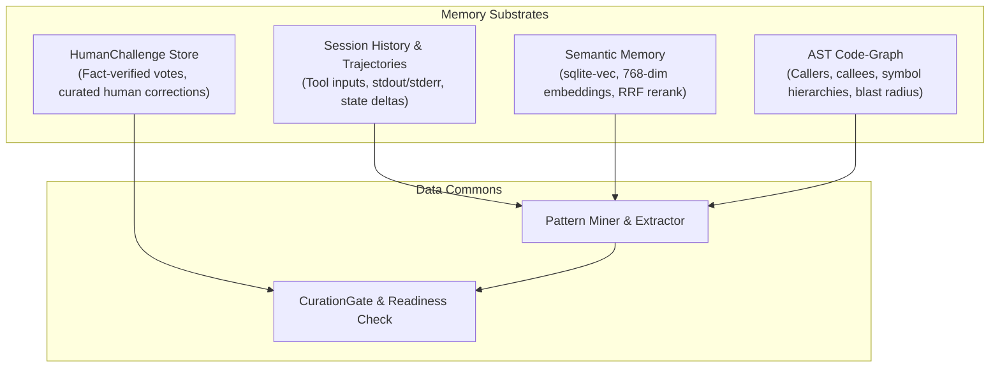

# 🧠 Xavier Architecture: SLM Micro-Experts & Anonymized Datalake Pipeline

## 1. Executive Summary & Architecture Overview

The **Xavier SLM Micro-Expert & Datalake Pipeline** provides an automated, privacy-first distillation engine that extracts high-value cognitive trajectories, static AST call graphs, semantic RAG memories, and execution telemetry from the Xavier runtime into reproducible training bundles. These bundles feed the training of hyper-specialized **Small Language Models (SLMs / Micro-Experts)** ranging from **0.5B to 3B parameters** (such as `Qwen2.5-Coder-0.5B/1.5B`, `SmolLM2-1.7B`, and `Llama-3.2-1B/3B`).

Instead of dispatching repetitive, low-latency code-intelligence chores to expensive, high-latency frontier models (e.g., GPT-4o, Claude 3.5 Sonnet), Xavier deploys local Micro-Experts that achieve **sub-100ms startup times**, run entirely on consumer CPUs or local VRAM, and achieve deterministic accuracy on dedicated operational chores.

```
+---------------------------------------------------------------------------------------------------------+
|                                        Xavier Runtime Substrates                                        |
|  +-----------------------+  +---------------------------+  +--------------------+  +-----------------+  |
|  |  Session Trajectories |  |   Semantic RAG Memory     |  | AST Code-Graph DB  |  | HumanChallenge  |  |
|  |  (Tool calls, traces) |  | (sqlite-vec / embeddings) |  | (Call hierarchies) |  | (Curated votes) |  |
|  +-----------+-----------+  +-------------+-------------+  +---------+----------+  +--------+--------+  |
+--------------|----------------------------|--------------------------|----------------------|-----------+
               |                            |                          |                      |
               +----------------------------v--------------------------v----------------------+
                                            |
                                            v
+---------------------------------------------------------------------------------------------------------+
|                           Pattern Miner & Hierarchical Curation Gate                                    |
|   - Trajectory Extraction (Problem -> Hypothesis -> AST Lookup -> Tool Invocation -> Resolution)        |
|   - Negative Trajectory Filtering (Syntax errors, failed tool invocations, clearance violations)       |
|   - TrainingReadinessGate: min_accepted_votes, min_fact_verified_ratio, min_training_eligible_ratio     |
+-------------------------------------------+-------------------------------------------------------------+
                                            |
                                            v
+---------------------------------------------------------------------------------------------------------+
|                                    Multi-Tier Anonymization Engine                                      |
|                                                                                                         |
|       [P4: Local-Only Track]                              [P3: Colab-Anonymized Track]                  |
|       - 100% On-Device                                    - Path Sanitization (/home/[USER]/...)        |
|       - Zero data egress                                  - Secret & API Key Scrubbing ([API_KEY])      |
|       - Full fidelity preservation                        - Deterministic Entity Pseudonymization       |
|                                                           - ChaCha8 Deterministic Train/Eval Split      |
|                                                           - Laplace Differential Privacy Noise          |
|                                                           - k-Anonymity Verification (k >= 5)           |
+-------------------------------------------+-------------------------------------------------------------+
                                            |
                                            v
+---------------------------------------------------------------------------------------------------------+
|                                      Training Bundle Export Subsystem                                   |
|   - train.jsonl (Instruction-tuning / SFT)                - bundle_manifest.json (Reproducibility seed) |
|   - eval.jsonl (Deterministic validation split)           - anonymization_audit.json (PII & k-metrics)  |
+-------------------------------------------+-------------------------------------------------------------+
                                            |
                         +------------------+------------------+
                         |                                     |
                         v                                     v
+------------------------------------+  +---------------------------------------------------------------+
|      Local Training Track (P4)     |  |                 Cloud Ephemeral Pipeline (P3)                 |
| - On-Device LoRA / QLoRA           |  | - Google Colab Free/Pro (T4 / A100 GPU)                       |
| - llama.cpp / MLX fine-tuning      |  | - Unsloth / Hugging Face PEFT Pipeline (train_lora_colab.py)  |
| - Consumer CPU / Apple Silicon     |  | - GGUF Quantization (Q4_K_M / Q8_0) & Zero-Leak Teardown     |
+-----------------+------------------+  +-------------------------------+-------------------------------+
                  |                                                     |
                  +--------------------------+--------------------------+
                                             |
                                             v
+---------------------------------------------------------------------------------------------------------+
|                                  Serving & Micro-Expert Orchestration                                   |
|   - Persistent Registry: MiniExpertRegistry (.xavier/mini_experts.json / data/mini_experts.json)        |
|   - Execution Engines: Ollama (ollama create / Modelfile), llama-server, ProviderRouter                 |
|   - Fast Specialized Dispatch: Tool calling, AST blast radius, PR review, unit test synthesis           |
+---------------------------------------------------------------------------------------------------------+
```

---

## 2. Ingestion & Cognitive Memory Foundations

Xavier unifies four complementary memory substrates to capture full development and operational context:



### 2.1. Substrate Specifications

1. **Session Trajectories (`src/session/`)**:
   Captures interactive execution steps: user instructions, internal monologue, tool calls (arguments, output code, execution status), and file modifications. Trajectories are tagged with clearance levels and session identifiers.

2. **Semantic Memory (`src/memory/qmd_memory/`)**:
   Indexed using [`sqlite-vec`](file:///home/belal/proyectosSWAL/apps/xavier/docs/adr/006-vector-store-local-sqlite-vec.md) embeddings. Stores fragments of past solutions, debugging hypotheses, and documentation snippets. Retrieved using Reciprocal Rank Fusion (RRF) and Cross-Encoder reranking.

3. **AST Code-Graph (`code-graph/` & `src/memory/snippet_writethrough.rs`)**:
   Extracts AST symbols (functions, structs, traits, method signatures) across languages (Rust, TypeScript, Python, Go). Maintains caller/callee directed graphs and calculates transitive blast radius when modifying symbols.

4. **HumanChallenge Knowledge (`src/humanchallenge/`)**:
   Stores peer-reviewed and curator-verified feedback. Guarantees that extracted training samples reflect validated domain ground truth rather than hallucinatory drift.

---

## 3. Pattern Mining, Trajectory Synthesis & Curation Gate

Raw telemetry contains noise, failed runs, syntax errors, and temporary exploratory experiments. The **Pattern Miner** filters and transforms traces into high-density supervised fine-tuning (SFT) pairs.

### 3.1. Synthesis Pipeline

```
Raw Interaction Trace 
  -> Prune Aborted Commands & Uncaught Panics
  -> Identify State Transitions (Pre-condition -> Action -> Post-condition)
  -> Bind AST Context (Symbol definitions & Callers)
  -> Format as Instruction/Input/Output Trajectory
```

Positive training instances must satisfy:
- Exit code `0` on terminal operations.
- Successful AST compilation or test suite pass.
- Non-regression on affected blast-radius nodes in the code graph.

### 3.2. Curation Gate Implementation

The Curation Gate enforces quality and truthfulness before training bundle export. Implemented in [`src/humanchallenge/curation_gate.rs`](file:///home/belal/proyectosSWAL/apps/xavier/src/humanchallenge/curation_gate.rs):

```rust
// Core structs from src/humanchallenge/types.rs and curation_gate.rs
pub struct TrainingReadinessGate {
    pub min_accepted: usize,              // Minimum threshold of eligible votes (e.g. 500)
    pub min_fact_verified_ratio: f32,    // Threshold for fact-checked records (e.g. 0.80)
    pub min_training_eligible_ratio: f32, // Ratio of records explicitly approved for training (e.g. 0.90)
}

pub struct ReadinessCheckResult {
    pub is_ready: bool,
    pub eligible_count: usize,
    pub fact_verified_count: usize,
    pub training_eligible_count: usize,
    pub domain_tags: Vec<String>,
    pub message: String,
}
```

If `check_readiness()` yields `is_ready: false`, bundle export is blocked, preventing low-quality or untrusted data from entering model training loops.

---

## 3.3. Human Introspection & Pre-Training Refinement Module

Para evitar que los modelos pequeños (SLMs) sobreajusten o aprendan heurísticas superficiales de código o razonamiento, Xavier cuenta con un **Módulo de Afinamiento e Introspección Guiada por el Usuario** implementado en [`src/humanchallenge/introspection.rs`](file:///home/belal/proyectosSWAL/apps/xavier/src/humanchallenge/introspection.rs) y expuesto vía REST en [`src/server/maloca/introspection_routes.rs`](file:///home/belal/proyectosSWAL/apps/xavier/src/server/maloca/introspection_routes.rs).

### 3.3.1. Filosofía: El LLM Facilita, el Humano Destila el Insight
A diferencia de los enfoques donde un LLM grande simplemente "alucina" datos sintéticos, Xavier utiliza al agente como un **facilitador socrático**. El humano es quien profundiza, cuestiona supuestos y genera el razonamiento fundamental (*ground truth*) antes de que los ejemplos ingresen al datalake.

```
┌─────────────────────────────────────────────────────────────────────────┐
│              CICLO DE INTROSPECCIÓN HUMANA PRE-ENTRENAMIENTO            │
│                                                                         │
│   Desafío / Decisión Arquitectónica (HumanChallenge)                   │
│                                │                                        │
│                                ▼                                        │
│   ┌─────────────────────────────────────────────────────────────────┐   │
│   │             Técnica de Introspección Seleccionada               │   │
│   │   • 5 Whys (Causa raíz recursiva hasta nivel 5)                 │   │
│   │   • Socratic Questioning (Exploración socrática de supuestos)   │   │
│   │   • Pre-Mortem (Simulación de fallo a 6 meses vista)            │   │
│   │   • Steel Manning (Argumentación de la posición opuesta)        │   │
│   │   • First Principles (Descomposición en axiomas base)           │   │
│   │   • Pattern Recognition (Comparación con incidentes pasados)    │   │
│   └────────────────────────────┬────────────────────────────────────┘   │
│                                │                                        │
│                                ▼                                        │
│   ┌─────────────────────────────────────────────────────────────────┐   │
│   │ Diálogo Multiturno Guiado (REST /v1/maloca/introspection/*)     │   │
│   │   Turno 1..N: Guía LLM pregunta -> Humano reflexiona y responde │   │
│   │   Cálculo de Depth Score (0.0 a 1.0 según profundidad y detalle)│   │
│   └────────────────────────────┬────────────────────────────────────┘   │
│                                │                                        │
│                                ▼                                        │
│   ┌─────────────────────────────────────────────────────────────────┐   │
│   │ Extracción de Insights & Calificación de Elegibilidad           │   │
│   │   • `depth_score >= 0.70`                                       │   │
│   │   • `fact_verified = true`                                      │   │
│   │   • `training_eligible = true`                                  │   │
│   └────────────────────────────┬────────────────────────────────────┘   │
│                                │                                        │
│                                ▼                                        │
│       Aprobado para Datalake de Entrenamiento (CurationGate)            │
└─────────────────────────────────────────────────────────────────────────┘
```

### 3.3.2. Las 6 Técnicas de Afinamiento

1. **5 Porqués (`FiveWhys`)**:
   - Recomendado para: Errores recurrentes y fallos en tests.
   - Mecánica: Indaga iterativamente 5 niveles de causalidad. Al alcanzar el nivel 5, el motor auto-completa la sesión y sintetiza la causa raíz estructural.
2. **Cuestionamiento Socrático (`SocraticQuestioning`)**:
   - Recomendado para: `ChallengeType::Assumption` (suposiciones implícitas de arquitectura).
   - Mecánica: Preguntas enfocadas que desafían la validez universal o local del supuesto.
3. **Pre-Mortem (`PreMortem`)**:
   - Recomendado para: `ChallengeType::Decision` (decisiones de alto impacto, migraciones de esquema o cambios de protocolo).
   - Mecánica: Sitúa al usuario 6 meses en el futuro asumiendo un fallo catastrófico e identifica señales tempranas de alarma.
4. **Steel Manning (`SteelManning`)**:
   - Recomendado para: `ChallengeType::Contradiction` (conflictos de especificación).
   - Mecánica: Obliga a construir el caso más sólido y fundamentado posible para la posición contraria.
5. **Primeros Principios (`FirstPrinciples`)**:
   - Recomendado para: `ChallengeType::Execution` (estrategias complejas de optimización y algoritmos).
   - Mecánica: Descompone los supuestos hasta llegar a los axiomas físicos/matemáticos no negociables.
6. **Reconocimiento de Patrones (`PatternRecognition`)**:
   - Recomendado para: `ChallengeType::Clarification` (ambigüedades en diseño de software).
   - Mecánica: Compara la situación actual con arquitecturas previas y analiza diferencias de contexto.

### 3.3.3. Contrato de API REST para Introspección

Montado bajo `/v1/maloca/introspection/*`:

| Método | Ruta | Función |
|---|---|---|
| `POST` | `/v1/maloca/introspection/start` | Inicia una sesión con la técnica recomendada o personalizada. |
| `POST` | `/v1/maloca/introspection/{id}/turn` | Procesa la respuesta humana y devuelve la siguiente pregunta socrática. |
| `POST` | `/v1/maloca/introspection/{id}/complete` | Finaliza la sesión, computa el `depth_score` y extrae los insights. |
| `GET` | `/v1/maloca/introspection/{id}` | Consulta el estado, turnos e insights de una sesión. |

#### Ejemplo de Flujo Interactivo:
```bash
# 1. Iniciar sesión de introspección Pre-Mortem sobre decisión de almacenamiento
curl -X POST http://localhost:8006/v1/maloca/introspection/start \
  -H "Content-Type: application/json" \
  -d '{
    "challenge_id": "hc_01J7ABCDEF...",
    "challenge_type": "decision",
    "description": "Migrar índices de memoria de SQLite a RocksDB",
    "technique": "pre_mortem"
  }'

# 2. Responder al turno socrático
curl -X POST http://localhost:8006/v1/maloca/introspection/is_01J7XYZ.../turn \
  -H "Content-Type: application/json" \
  -d '{
    "human_input": "El fallo principal ocurriría por fragmentación excesiva de memoria en nodos con menos de 2GB de RAM.",
    "challenge_description": "Migrar índices de memoria de SQLite a RocksDB"
  }'
```

### 3.3.4. Garantía de Privacidad P4
Toda la sesión de introspección se almacena en SQLite local (`introspection_sessions`) bajo la garantía estricta **Privacy P4 (Local Only)**. Los intercambios socráticos solo se integran al datalake de exportación si el humano marca explícitamente `training_eligible = true`.

---


## 4. Multi-Tier Privacy & Anonymization Engine

Xavier implements a multi-tier privacy architecture in [`src/data_commons/privacy.rs`](file:///home/belal/proyectosSWAL/apps/xavier/src/data_commons/privacy.rs).

### 4.1. Privacy Levels

| Level | Identifier | Ingress / Egress Boundary | Transformations Applied | Informed Consent |
|---|---|---|---|---|
| **P4 (Local Only)** | `PrivacyLevel::LocalOnly` | Dataset strictly retained on-device; zero outbound packets | None (Raw local fidelity preserved) | Not required |
| **P3 (Colab Anonymized)** | `PrivacyLevel::ColabAnonymized` | Ephemeral Google Colab / External GPU compute | Full scrub, entity pseudonymization, Laplace DP, $k$-anonymity | **Strictly Required** |
| **P2 (Enterprise ZDR)** | `PrivacyLevel::EnterpriseZdr` | Dedicated bare-metal cloud with Zero Data Retention | PII scrubbing, cryptographic deletion attestations | Required |

```mermaid
flowchart TD
    Raw[Raw Training Record] --> LevelCheck{PrivacyLevel?}
    LevelCheck -->|LocalOnly P4| LocalBundle[train.jsonl / eval.jsonl (Local Unmodified)]
    
    LevelCheck -->|ColabAnonymized P3| Step1[Step 1: Filesystem Path Scrubbing]
    Step1 --> Step2[Step 2: Cryptographic Key & Wallet Scrubbing]
    Step2 --> Step3[Step 3: Email & Contact Masking]
    Step3 --> Step4[Step 4: API Key & Bearer Token Redaction]
    Step4 --> Step5[Step 5: Deterministic Entity Pseudonymization]
    Step5 --> Step6[Step 6: Differential Privacy Laplace Noise]
    Step6 --> Step7[Step 7: k-Anonymity Group Verification]
    Step7 --> Gate{k >= 5 Passed?}
    Gate -->|No| Exclude[Reject / Exclude Record & Log Warning]
    Gate -->|Yes| P3Bundle[Export Anonymized Bundle + Audit Report]
```

### 4.2. Scrubbing Rules and Transformations

1. **Filesystem Paths**:
   Converts system paths to sanitized tokens:
   - `/home/belal/proyectosSWAL/apps/xavier/src/main.rs` $\longrightarrow$ `/home/[USER]/proyectosSWAL/apps/xavier/src/main.rs`
   - `/Users/dev/repo/...` $\longrightarrow$ `/home/[USER]/repo/...`
   - Windows drives `C:\Users\username\...` $\longrightarrow$ `[DRIVE]/[USER]/...`

2. **Cryptographic Keys & Wallet Addresses**:
   Detects hex strings longer than 32 characters, Solana Base58 addresses, and Ethereum Bech32/EIP-55 hashes:
   - `0x71C84918370533a26017b3738b7156da7014EA52` $\longrightarrow$ `[KEY]`
   - `ed25519:4a8b...` $\longrightarrow$ `[KEY]`

3. **API Keys and Secrets**:
   Scans pattern regexes matching `sk-[a-zA-Z0-9]{32,}`, `pk-[a-zA-Z0-9]{16,}`, and `Bearer <token>`:
   - Replaced with `[API_KEY]`.

4. **Entity Pseudonymization**:
   Replaces author identities and organization names with deterministic aliases (`[PERSON_A]`, `[ORG_X]`) derived from keyed hashes, preserving relational consistency across conversations while obscuring identity.

### 4.3. Mathematical Guarantees: Differential Privacy & $k$-Anonymity

- **Laplace Differential Privacy**:
  For quantitative metadata (token usage, latency metrics, confidence scores), numerical values undergo perturbation using the Laplace mechanism:
  $$M(x) = x + \text{Lap}\left(\frac{\Delta f}{\epsilon}\right)$$
  Where $\Delta f$ is the sensitivity and $\epsilon$ represents the privacy budget. Deterministic noise generation utilizes [`rand_chacha::ChaCha8Rng`](file:///home/belal/proyectosSWAL/apps/xavier/src/data_commons/training.rs#L5-L7) keyed by a user-provided seed.

- **$k$-Anonymity Verification**:
  Records are clustered by quasi-identifiers: `(challenge_type, domain_tag)`. The dataset is approved for export if and only if:
  $$\min_{g \in \text{Groups}} |g| \ge k \quad (\text{default } k = 5)$$
  If any quasi-identifier group contains fewer than $k$ records, bundle export halts with an audit warning.

---

## 5. Training Bundle Export Specification

When invoked via [`TrainingExporter::generate_bundle`](file:///home/belal/proyectosSWAL/apps/xavier/src/data_commons/training.rs#L51-L144), Xavier emits four primary artifacts into the destination directory:

```
dataset_dir/
├── bundle_manifest.json       # Bundle metadata, split ratios, and seed
├── train.jsonl                # Formatted instruction-tuning train set
├── eval.jsonl                 # Validation split
└── anonymization_audit.json   # Cryptographic proof of privacy compliance
```

### 5.1. `bundle_manifest.json` Schema

```json
{
  "version": "1.0.0",
  "dataset_id": "codebase-f12-ast-expert",
  "generated_at": "2026-09-12T11:54:32Z",
  "usage_policy": "Research and model fine-tuning only",
  "reproducibility_seed": 42,
  "clearance": "INTERNAL",
  "language": "es",
  "segment": "codebase/ast_tools",
  "split_counts": {
    "train": 1800,
    "eval": 200
  },
  "data_files": [
    "train.jsonl",
    "eval.jsonl"
  ]
}
```

### 5.2. `train.jsonl` & `eval.jsonl` Record Format

Each line is an independently parsable JSON object tailored for standard causal LM instruction formatting:

```json
{
  "id": "7a3f8c12-9b24-4f11-8e31-019a2b53c1d4",
  "instruction": "Determine the downstream AST blast radius when modifying struct `SnippetWriteThrough` in module `src/memory/snippet_writethrough.rs`.",
  "input": "Available code-graph edges:\n- `src/memory/mod.rs` (imports `SnippetWriteThrough`)\n- `src/server/routes.rs` (invokes `SnippetWriteThrough::flush()`)\nTarget edit: change `flush()` signature to return `Result<FlushStats, StorageError>`.",
  "output": "Affected AST symbols (blast radius = 2):\n1. `src/memory/mod.rs`: Re-export mapping for `SnippetWriteThrough` requires updated error propagation.\n2. `src/server/routes.rs:L142`: Call-site `snippet_store.flush()` must match on `Ok(FlushStats)` and bubble up `StorageError` as HTTP 500.",
  "metadata": {
    "domain_tag": "rust_ast",
    "clearance": 1,
    "confidence": 0.98
  }
}
```

### 5.3. `anonymization_audit.json` Schema

Emitted from [`PrivacyAuditReport`](file:///home/belal/proyectosSWAL/apps/xavier/src/data_commons/privacy.rs#L50-L69):

```json
{
  "privacy_level": "p3_colab_anon",
  "total_records": 2000,
  "pii_detections": 142,
  "entities_replaced": 142,
  "paths_scrubbed": 87,
  "keys_scrubbed": 31,
  "noise_applied": true,
  "k_anonymity_min_group": 12,
  "k_anonymity_passed": true,
  "excluded_records": 0,
  "warnings": []
}
```

---

## 6. Micro-Expert Profiles & Architecture Archetypes

Xavier focuses on Small Language Models (SLMs) in the **0.5B to 3B parameter** envelope. These models offer distinct advantages over multi-billion parameter architectures:
- **Instant Cold Boot**: Under 100ms when hosted in system RAM / CPU via `llama.cpp` or unified VRAM on Apple Silicon.
- **Minimal Footprint**: 400MB to 1.8GB in 4-bit quantization (`Q4_K_M`), easily co-existing with development tools.
- **High Token Velocity**: 80–140 tokens/second on consumer-grade hardware.
- **High Zero-Shot Tool Fidelity**: Eliminates conversational filler, outputting structured JSON tool arguments or code patches directly.

### 6.1. Target Base Models

| Base Architecture | Parameter Count | Quantized Footprint (Q4_K_M) | Primary Specialization Target |
|---|---|---|---|
| **Qwen2.5-Coder-0.5B** | 0.49B | ~380 MB | Ultra-fast Tool Calling, Redaction Linting |
| **Qwen2.5-Coder-1.5B** | 1.54B | ~980 MB | AST Blast Radius, Rust/TS Unit Test Synthesis |
| **SmolLM2-1.7B** | 1.71B | ~1.10 GB | HumanChallenge Q&A, Trajectory Summarization |
| **Llama-3.2-1B** | 1.23B | ~820 MB | Structured Patch Generation, Git Commit Formatter |
| **Llama-3.2-3B** | 3.21B | ~2.10 GB | Architectural PR Review, Multi-File Refactoring |

### 6.2. Specialization Archetypes

```
+-----------------------------------------------------------------------------------+
|                            Micro-Expert Specializations                           |
+---------------------+---------------------+-------------------+-------------------+
|  AST Blast Radius   |   Structured Tool   |  Unit Test / Mock |  Diff Reviewer &  |
|      Estimator      |     Dispatcher      |    Synthesizer    |  Redaction Linter |
|                     |                     |                   |                   |
| Parses caller/callee| Converts natural    | Ingests symbol    | Verifies code     |
| graphs to compute   | language intent into| signature and generates| against clearance|
| affected symbols and| strict JSON schemas | idiomatic test    | policies and PII  |
| breaking changes.   | with zero preamble. | scaffolding.      | leakage patterns. |
+---------------------+---------------------+-------------------+-------------------+
```

---

## 7. Dual-Track Training Runtimes

### Track A: Local On-Device Training (P4)

For confidential environments where code cannot leave the local workstation:
- **Frameworks**: Native LoRA/QLoRA via MLX on Apple Silicon or quantized fine-tuning via `llama.cpp` / PyTorch CPU.
- **Workflow**:
  1. Xavier exports bundle locally using `PrivacyLevel::LocalOnly`.
  2. Local daemon executes fine-tuning on consumer GPU or unified memory.
  3. Weights are merged directly into a local `.gguf` file.
  4. Registered in [`MiniExpertRegistry`](file:///home/belal/proyectosSWAL/apps/xavier/src/agents/mini_experts.rs#L63-L89) without network interaction.

### Track B: Ephemeral Cloud Pipeline (P3 Google Colab Free / Pro)

For fast training utilizing remote hardware (NVIDIA T4 or A100):
- **Script**: [`scripts/training/train_lora_colab.py`](file:///home/belal/proyectosSWAL/apps/xavier/scripts/training/train_lora_colab.py)
- **Features**:
  - Uses Unsloth or Hugging Face PEFT with 4-bit bitsandbytes quantization.
  - Pulls anonymized dataset via `/v1/training/datasets/{id}/train`.
  - LoRA rank $r=16$, $\alpha=32$, targeting query, key, value, and projection modules (`q_proj`, `k_proj`, `v_proj`, `o_proj`).
  - Automatically merges adapter weights back into base model (`merge_and_unload`).
  - Converts merged float16 weights into quantized GGUF format (`convert_hf_to_gguf.py --outtype q4_k_m`).
  - **Zero-Leak Guarantee**: Colab runtime is strictly ephemeral; upon artifact emission to the developer's storage, the runtime disk is wiped.

---

## 8. Registry, Serving & Xavier Runtime Integration

### 8.1. The Mini-Expert Registry

Mini-Experts are registered in persistent storage via [`MiniExpertRegistry`](file:///home/belal/proyectosSWAL/apps/xavier/src/agents/mini_experts.rs#L63-L89) stored at `.xavier/mini_experts.json` or `data/mini_experts.json`:

```rust
pub struct MiniExpertEntry {
    pub name: String,              // e.g. "ast-radius-expert"
    pub segment: String,           // e.g. "codebase/ast_tools"
    pub language: String,          // e.g. "es", "en"
    pub clearance: u8,             // 0 to 5 (maps to ClearanceLevel)
    pub source_dataset: String,    // ID of originating training bundle
    pub model_gguf_path: String,   // Local absolute or relative path to .gguf
    pub provider: String,          // "local" or "ollama"
    pub endpoint: String,          // e.g. "http://localhost:11434/v1"
    pub api_key: Option<String>,
}
```

### 8.2. Local Serving via Ollama

The automated pipeline in [`scripts/mini-expert-train.sh`](file:///home/belal/proyectosSWAL/apps/xavier/scripts/mini-expert-train.sh) generates an Ollama `Modelfile` and publishes the model to the local daemon:

```dockerfile
FROM /path/to/build/mini-experts/ast-radius-expert/model-q4_k_m.gguf
PARAMETER temperature 0.1
PARAMETER stop "<|im_end|>"
SYSTEM """You are a Xavier Micro-Expert specialized in AST Blast Radius estimation."""
```

The shell pipeline automates execution:
```bash
ollama create ast-radius-expert -f Modelfile
```

Once loaded, Xavier's internal `ProviderRouter` routes task-specific queries to the local endpoint (`http://localhost:11434/v1`). If a query exceeds the micro-expert's domain clearance or context bounds, the query falls back to higher-tier models.

---

## 9. REST API & CLI Command Reference

### 9.1. REST API Endpoints

Mounted under `/v1/training/*` and `/v1/curation/*` in [`src/server/training_routes.rs`](file:///home/belal/proyectosSWAL/apps/xavier/src/server/training_routes.rs):

| Method | Route | Description |
|---|---|---|
| `GET` | `/v1/training/datasets` | List all discovered datasets and split metadata |
| `GET` | `/v1/training/datasets/{id}` | Retrieve `bundle_manifest.json` for a dataset |
| `GET` | `/v1/training/datasets/{id}/train` | Stream `train.jsonl` split |
| `GET` | `/v1/training/datasets/{id}/eval` | Stream `eval.jsonl` split |
| `POST` | `/v1/training/bundles` | Trigger bundle generation from telemetry/memory DB |
| `POST` | `/v1/training/export` | Export reproducible dataset with privacy parameters |
| `POST` | `/v1/training/curate/bulk` | Bulk approve/reject items in the curation queue |
| `GET` | `/v1/curation/pending` | Fetch pending items awaiting human curation |
| `POST` | `/v1/curation/{id}/approve` | Approve a pending curation item |
| `POST` | `/v1/curation/{id}/reject` | Reject a pending curation item with reason |

#### Example: Exporting a P3 Bundle

```bash
curl -X POST http://localhost:8006/v1/training/export \
  -H "Content-Type: application/json" \
  -d '{
    "seed": 42,
    "eval_ratio": 0.15,
    "curated_only": true,
    "format": "jsonl"
  }'
```

### 9.2. CLI Commands

Managed via [`src/cli/handlers/mini_experts.rs`](file:///home/belal/proyectosSWAL/apps/xavier/src/cli/handlers/mini_experts.rs) and [`scripts/mini-expert-train.sh`](file:///home/belal/proyectosSWAL/apps/xavier/scripts/mini-expert-train.sh):

```bash
# 1. Register a newly trained micro-expert in Xavier's registry
xavier mini-expert add \
  --name ast-blast-expert \
  --segment codebase/ast \
  --language es \
  --clearance 1 \
  --source-dataset ds-ast-20260912 \
  --model-gguf-path /opt/models/ast-blast-expert.gguf \
  --provider local \
  --endpoint http://localhost:11434/v1

# 2. List all registered micro-experts
xavier mini-expert list

# 3. Serve a micro-expert locally via Ollama port forwarding
xavier mini-expert serve --name ast-blast-expert --port 11434

# 4. Execute the complete end-to-end training pipeline via shell
./scripts/mini-expert-train.sh \
  --name f12-ast-expert \
  --segment codebase/f12 \
  --language es \
  --clearance 1 \
  --source-dataset xavier-telemetry \
  --output-dir ./build/mini-experts \
  --xavier-url http://localhost:8006
```

---

## 10. Security, Clearance & Cryptographic Verification

### 10.1. Multi-Level Clearance Enforcement

All dataset records carry a `clearance` attribute (0 through 5, corresponding to `ClearanceLevel`: Public, Internal, Confidential, Secret, TopSecret). When generating training bundles:
- `ClearanceLevel::Public` (0) and `ClearanceLevel::Internal` (1) may be exported to P3 Colab instances upon user confirmation.
- `ClearanceLevel::Confidential` (2) and above are **hard-blocked** from P3 export, forcing training into local P4 execution mode.

### 10.2. Cryptographic Hash Tracking & Non-Repudiation

To maintain traceability without exposing source identities:
- Every record in `train.jsonl` contains `original_id_hash = SHA256(source_id + salt)`.
- Telemetry origins in [`src/data_commons/training.rs`](file:///home/belal/proyectosSWAL/apps/xavier/src/data_commons/training.rs#L146-L152) use:
  $$\text{AnonymizedID} = \text{Hex}(\text{SHA256}(\text{wallet\_bytes} \,\|\, \text{seed\_bytes}))[0..16]$$
- Revocation lists allow a contributor to withdraw their wallet; upon subsequent bundle exports, matching records are excluded without needing to decrypt the historic payloads.

---

## 11. Cross-Reference & Feature Matrix Alignment

This specification operationalizes the following modules in the Xavier architecture:

- [`src/data_commons/training.rs`](file:///home/belal/proyectosSWAL/apps/xavier/src/data_commons/training.rs): Deterministic training bundle exporter, ChaCha8 RNG splitting, and dataset scanning.
- [`src/data_commons/privacy.rs`](file:///home/belal/proyectosSWAL/apps/xavier/src/data_commons/privacy.rs): Three-level privacy pipeline, Laplace DP noise generator, and $k$-anonymity verification.
- [`src/humanchallenge/curation_gate.rs`](file:///home/belal/proyectosSWAL/apps/xavier/src/humanchallenge/curation_gate.rs): Human-in-the-loop quality threshold verification.
- [`src/agents/mini_experts.rs`](file:///home/belal/proyectosSWAL/apps/xavier/src/agents/mini_experts.rs): Persistent registry for local mini-experts.
- [`src/models/mini_expert.rs`](file:///home/belal/proyectosSWAL/apps/xavier/src/models/mini_expert.rs): Data structures, clearance mappings, and serialization formats.
- [`src/server/training_routes.rs`](file:///home/belal/proyectosSWAL/apps/xavier/src/server/training_routes.rs): Axum REST API exposing dataset streaming, curation queues, and bundle exports.
- [`scripts/training/train_lora_colab.py`](file:///home/belal/proyectosSWAL/apps/xavier/scripts/training/train_lora_colab.py): Remote T4/A100 GPU LoRA fine-tuning and GGUF quantization.
- [`scripts/mini-expert-train.sh`](file:///home/belal/proyectosSWAL/apps/xavier/scripts/mini-expert-train.sh): CLI orchestration pipeline connecting export, training, GGUF conversion, and Ollama deployment.
- [`docs/FEATURE_STATUS.md`](file:///home/belal/proyectosSWAL/apps/xavier/docs/FEATURE_STATUS.md): Repository feature status tracking WAVE-4 and WAVE-5 milestones.
