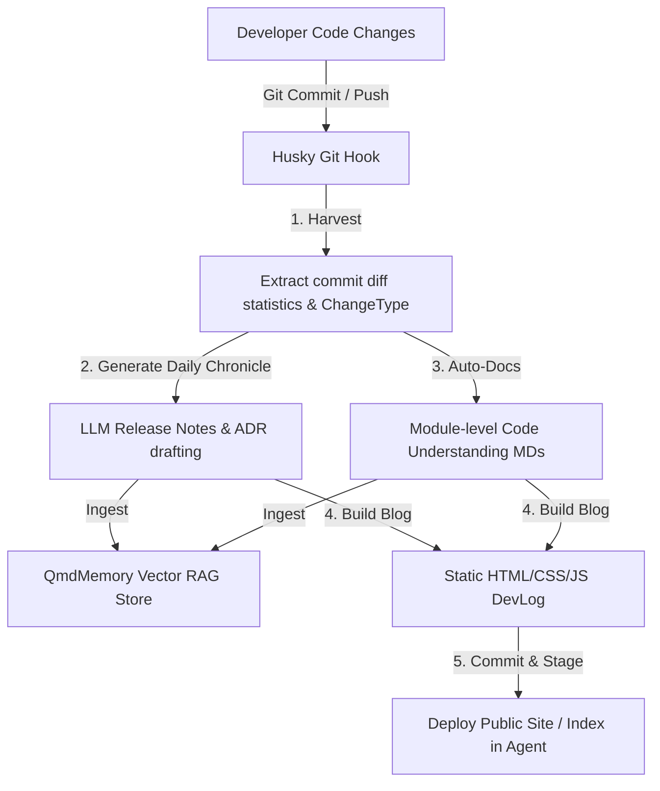

# Xavier Chronicle & Change-Control RAG Blueprint

This blueprint outlines how **Xavier** bridges Git changes, automated documentation, RAG (Retrieval-Augmented Generation) memory stores, and a beautiful user-facing developer log (SSG blog) in a continuous circular lifecycle.

---

## 🌀 The Circular Documentation & RAG Lifecycle

Every time a developer makes a commit or prepares a release, the following cycle occurs:



1. **Git Harvest**: Inspects active branches and commits to calculate diff-statistics (`insertions`, `deletions`, `ChangeType`).
2. **Daily Chronicle ADRs**: An LLM reviews the harvest metrics to draft highly contextual decision logs and release posts.
3. **Module Auto-Docs**: Inspects the entire codebase tree-sitter structure to generate comprehensive module docs.
4. **Vector RAG Ingestion**: Both the modules and the chronicles are embedded via local BERT and stored inside `MemoryStore` for the AI agent to search and query.
5. **Static Site Build (SSG)**: Compiles beautiful HTML/CSS/JS pages inside `public/devlog/` to share the progress publicly.

---

## 🛠️ Setup for Your Repository (Replication)

Any project using Xavier can replicate this system in a few simple steps:

### 1. Install Dependencies
Ensure you have the monorepo configuration with `husky` initialized:
```bash
npm install husky --save-dev
npx husky init
```

### 2. Configure the Pre-commit Hook
Overwrite `.husky/pre-commit` to invoke the chronicle runner:
```bash
#!/bin/sh
. "$(dirname "$0")/_/husky.sh"

./scripts/pre-commit-chronicle.sh
```

Ensure it's executable:
```bash
chmod +x .husky/pre-commit
```

### 3. Setup the Automation Script
Place the following script under `scripts/pre-commit-chronicle.sh`:
```bash
#!/usr/bin/env bash
set -e

# Navigate to repo root
cd "$(git rev-parse --show-toplevel)"

# Load local environment variables (.env contains XAVIER_TOKEN)
if [ -f .env ]; then
  export $(grep -v '^#' .env | xargs)
fi

echo "🛡️ Executing Xavier pre-commit documentation and RAG indexing..."

# 1. Harvest git diff metrics
cargo run --bin xavier -- chronicle harvest

# 2. Ingest Daily Chronicle log (ADRs) to RAG
cargo run --bin xavier -- chronicle generate --ingest

# 3. Ingest Code Understanding Auto-Docs to RAG
cargo run --bin xavier -- chronicle auto-docs --ingest

# 4. Compile the static developer blog
cargo run --bin xavier -- chronicle build

# 5. Automatically stage generated files to commit
git add docs/devlog/ docs/auto-docs/ public/devlog/ || true
```

Ensure the script is executable:
```bash
chmod +x scripts/pre-commit-chronicle.sh
```

---

## 💡 Why This Matters for Agent RAG

Standard code-indexing RAG pipelines often miss **intent**—the *why* behind a code change. By connecting Git commit diff quantifiers with release/ADR logs and module summaries in a unified `MemoryRecord`, Xavier agents gain:
- **Temporal Memory**: The ability to answer "When and why was the websocket authentication changed?"
- **Impact Analysis**: Knowing which modules are highly complex (`complexity_hotspots` in metadata) or experience high churn.
- **Self-Improving Memory**: When the agent modifies code, it automatically updates its own searchable memory on the next commit, avoiding stale knowledge.
