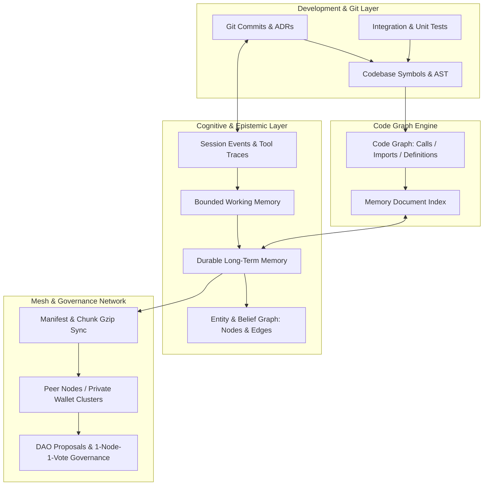

# 🕸️ Xavier Graph Architecture & Knowledge Interconnection Model

This document outlines the interconnected graph topologies that power **Xavier v1.0.0**, bridging static codebase structures, epistemic agent beliefs, session conversation memories, test verification traces, and commit histories.

---

## 1. Unified Interconnected Graph Overview



---

## 2. Graph Domains and Schema Definitions

### A. Code Graph (`code-graph/`)
- **Nodes**: Source files, functions, structs, traits, methods, constants, modules.
- **Edges**: `calls`, `imports`, `implements`, `defines`, `referenced_by`.
- **Deduplication**: Hash-based deduplication preventing symbol bloat across multiple file versions.
- **Integration**: Mapped directly to [`MemoryDocument`](file:///home/belal/proyectosSWAL/apps/xavier/src/memory/qmd_memory/types.rs) records with `kind: "code_symbol"`.

### B. Epistemic Belief & Entity Graphs (`src/workspace/`, `src/memory/`)
- **Entity Nodes**: Real-world actors, systems, tools, projects, and concepts identified during agent conversations.
- **Belief Nodes**: Subjective or factual assertions made by agents with metadata:
  - `confidence`: Float between `0.0` and `1.0`.
  - `source_session`: Conversation ULID.
  - `temporal_validity`: Valid-from / Valid-until timestamps.
- **Edges**: `supports`, `refutes`, `supersedes`, `associates_with`.

### C. Session Memory & Trajectory Graph (`src/session/`)
- **Event Stream**: Chronological session events (`SessionEvent`) recording user queries, tool executions, and model responses.
- **Working Memory Buffer**: Active working window feeding recent context into agent prompts before archiving to SQLite.
- **Traceability**: Every cognitive memory points to its originating `session_id`, enabling agents to trace back the exact rationale for past decisions.

### D. Verification & Test Coverage Matrix
- **Unit Tests**: 1,994 tests validating micro-behaviors across stores, PRAGMAs, migrations, and encryption.
- **Integration Test Suites**:
  - [`tests/mesh_full_simulation_test.rs`](file:///home/belal/proyectosSWAL/apps/xavier/tests/mesh_full_simulation_test.rs): 3-node mesh convergence, wallet gating, P2P/ICE, ephemeral passes, DAO governance.
  - [`tests/mesh_security_sync_test.rs`](file:///home/belal/proyectosSWAL/apps/xavier/tests/mesh_security_sync_test.rs): ACL clearance matrix, tamper detection, replay attack resistance.
  - [`tests/mesh_permissions_test.rs`](file:///home/belal/proyectosSWAL/apps/xavier/tests/mesh_permissions_test.rs): Pairing secret exchange and auto-registration.

---

## 3. Querying the Interconnected Graph via API

### 1. Unified Search (`POST /v1/memories/search`)
Querying combines vector embeddings, lexical BM25 matching, and graph edge traversal:
```bash
curl -s -X POST http://localhost:8006/v1/memories/search \
  -H "Authorization: Bearer $XAVIER_TOKEN" \
  -H "Content-Type: application/json" \
  -d '{
    "query": "mesh network synchronization architecture",
    "limit": 5,
    "include_graph_links": true
  }'
```

### 2. Context Package Generation (`POST /v1/memory/context-package`)
Assembles bounded working context, graph entity neighborhoods, and relevant code symbols into a token-budgeted prompt payload:
```bash
curl -s -X POST http://localhost:8006/v1/memory/context-package \
  -H "Authorization: Bearer $XAVIER_TOKEN" \
  -H "Content-Type: application/json" \
  -d '{
    "query": "NAT traversal and STUN candidates",
    "token_budget": 2048
  }'
```

### 3. Recall Quality Evaluation (`POST /v1/memory/recall-eval`)
Runs automated retrieval benchmarking against known ground truth graph nodes to verify rank stability and hit rate.
