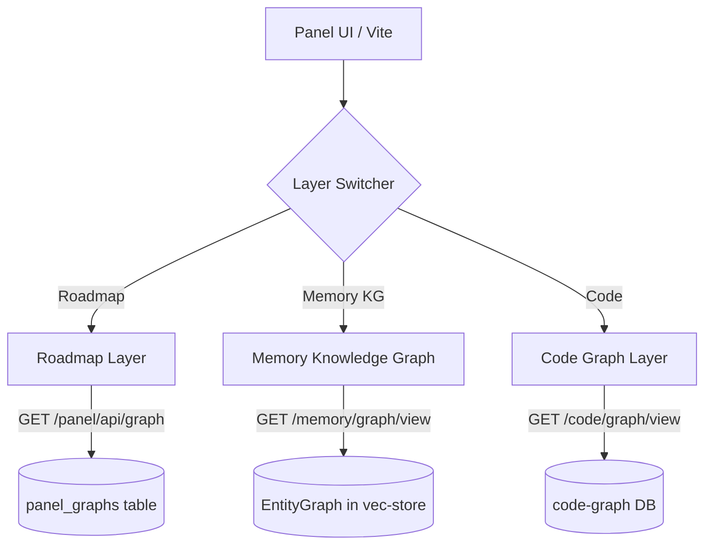

# Xavier Graph Explorer Layers

Xavier features a three-layer visual Graph Explorer in the Panel UI, allowing real-time visualization of cognitive connections, codebase structures, and project roadmaps.

---

## 🎨 Architecture & Layers

### 1. Roadmap Layer

- **Purpose**: Displays the hierarchical project roadmap, milestones, and dependencies.
- **Backend Endpoints**:
  - `GET /panel/api/graph` — Retrieve the current roadmap graph structure.
  - `POST /panel/api/graph` — Persist roadmap changes (CRUD).
- **Mutability**: Read/Write (fully editable via drag-and-drop, add/delete nodes/links).
- **Filters**: Supports filtering by milestone status and date range.

### 2. Memory Knowledge Graph Layer

- **Purpose**: Visualizes cognitive entities (facts, concepts, topics) extracted from ingested memories and the relationships between them.
- **Backend Endpoints**:
  - `GET /memory/graph/view` — Fetch the complete memory entity graph.
  - `GET /memory/graph/entities/{id}` — Fetch details for a specific entity (trust level, kind, snippet context).
- **Mutability**: Read-only in the explorer view (nodes are extracted automatically in the background via text processing/TGD).
- **Metadata**: Shows `truncated` badge if the graph exceeds the visual rendering limits.

### 3. Code Graph Layer

- **Purpose**: Visualizes imports, module structures, and dependencies of the indexed codebase.
- **Backend Endpoints**:
  - `GET /code/stats` — Check index stats (number of files, imports, symbols).
  - `POST /code/scan` — Scan the codebase (body: `{ "path": "src" }`) to populate the index.
  - `GET /code/graph/view?mode=overview` — Overview of module-level imports.
  - `GET /code/graph/view?mode=ego&query={node_id}` — Detailed ego-graph centered on a specific file or symbol (double-click to expand).
- **Mutability**: Read-only (rebuilt on codebase scan).

---

## 🔄 Canvas Adapters

To render these three distinct graphs in a single shared HTML5 Canvas / D3 component, the Panel UI uses adapters in `panel-ui/src/api/graphAdapters.ts`:

- **Roadmap Adapter**: Paints nodes using organizational/milestone colors with action menus.
- **Memory KG Adapter**: Maps cognitive entity types (`concept`, `fact`, `person`, `project`) to specific nodes.
- **Code Adapter**: Maps files and directories, coloring by extension or directory path and displaying double-click expansion triggers.

---

## ⚙️ Configuration & Environment

- **Sidecar Port**: The backend listens on `0.0.0.0:8006` (default).
- **File Storage**:
  - Roadmap: `vec-store.sqlite3` (`panel_graphs` table).
  - Memory KG: `vec-store.sqlite3` (`entities` and `entity_relations` tables).
  - Code Graph: `data/code_graph.db` (`symbols`, `imports`, `symbols_fts` tables).
