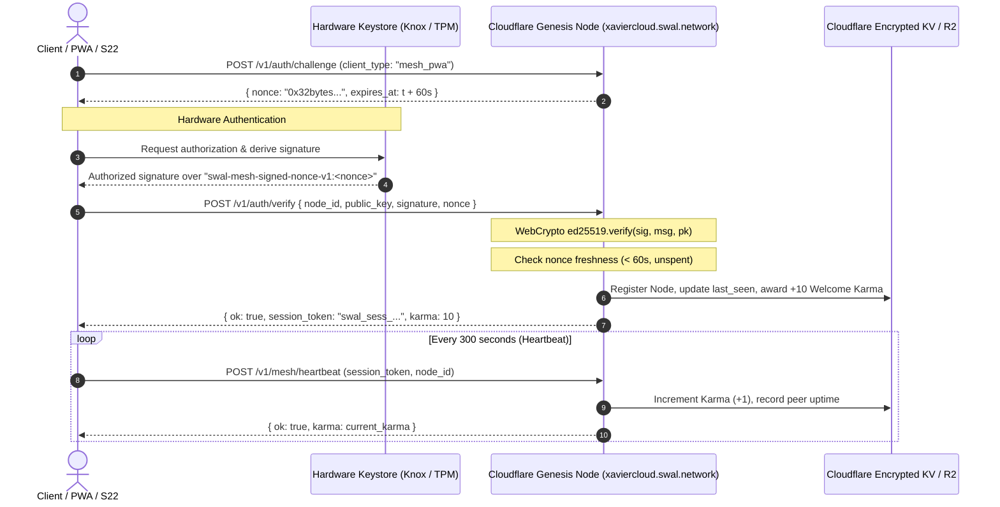

# SWAL Decentralized Node Authentication & Sovereign Hardware Security Specification
**Document ID:** SWAL-RFC-0042  
**Status:** Canonical / Active Draft  
**Target Entities:** AI Agent Audit Mesh (Jules, Hermes, Antigravity, Claude, Codex) & Human Security Engineers  
**Date:** 2026-09-12  

---

## 1. Executive Summary & Value Argument

Modern identity systems suffer from two fatal extremes:
1. **Web2 Centralized IdPs (OAuth / JWT / Password DBs):** Honey-pots vulnerable to credential stuffing, insider threats, and single-point-of-compromise.
2. **Web3 / Crypto Wallets (EVM / Solana Signatures):** Vulnerable to "Blind Signing" exploits, malicious approvals (`setApprovalForAll`), and irreversible asset drainage via phishing transactions.

### The SWAL Identity Paradigm: Sovereign Mesh Node Identity
In the SWAL ecosystem, **every user client (browser PWA, mobile device, or desktop daemon) operates as an autonomous cryptographic node**. 

- **Zero-Knowledge to Genesis:** The central node (Cloudflare Edge Worker) never sees, stores, or handles private keys or passwords. It only acts as an automated challenge generator, mathematical verifier, and availability registry.
- **Pure Authentication Primitive:** Signatures verify *identity proof-of-possession* within an ephemeral 60-second window (`swal-mesh-signed-nonce-v1:{nonce}`). They contain **no financial allowance or state-mutation authority**, rendering transaction-draining attacks completely useless.
- **Hardware-Rooted Trust:** In mobile devices (e.g., Samsung Galaxy S22 with Knox Vault / Android StrongBox) and desktops (TPM 2.0 / Apple Secure Enclave), master credentials are bound to dedicated silicon and require local biometric or hardware authorization.
- **Zero-Knowledge Shamir Recovery (2-of-3):** Cloud-assisted recovery without cloud custody. Cloudflare holds at most one encrypted share ($k=2$ threshold required), making a server compromise mathematically incapable of reconstructing the node's identity.

---

## 2. Cryptographic Architecture & Flow Diagram

### 2.1 Challenge-Response Handshake Sequence



### 2.2 Canonical Payload Specification
Every authentication signature MUST strictly conform to the UTF-8 payload format:
$$\text{Payload} = \texttt{"swal-mesh-signed-nonce-v1:"} \parallel \text{nonce}$$

Any signature over a message missing this domain separator is rejected by the Genesis Node, preventing cross-protocol signature replay.

---

## 3. Hardware Enclave & StrongBox Integration Architecture

### 3.1 Samsung Knox Vault & Android StrongBox Keymaster
On flagship devices such as the Samsung Galaxy S22, hardware isolation is provided by the Secure Processor and Dedicated Tamper-Resistant RAM (Knox Vault).

```
+-------------------------------------------------------------------+
| Normal World (Android OS / Apps)                                  |
|                                                                   |
|   +--------------------------+                                    |
|   |   SWAL Vault App / PWA   |                                    |
|   |  - Ed25519 Key Pair      |                                    |
|   |    (Encrypted in RAM)    |                                    |
|   +-------------+------------+                                    |
+-----------------|-------------------------------------------------+
                  | Binder / Android KeyStore IPC
+-----------------v-------------------------------------------------+
| Secure World / Knox Vault StrongBox (Isolated Silicon)             |
|                                                                   |
|   +-------------------------------------------------------------+ |
|   | Hardware Key Encryption Key (KEK): NIST P-256 (secp256r1)   | |
|   | Properties:                                                 | |
|   |  - PURPOSE_ENCRYPT | PURPOSE_DECRYPT                        | |
|   |  - insideSecureHardware = true                              | |
|   |  - userAuthenticationRequired = true (Biometric / PIN)      | |
|   +-------------------------------------------------------------+ |
+-------------------------------------------------------------------+
```

#### The Hardware Curve Bridging Problem & Solution:
* **The Reality:** Android `StrongBox` hardware keystores standardly support NIST P-256 (`secp256r1`) and RSA-2048/4096. Few mobile hardware keystores offer pure Ed25519 curve operations directly inside silicon.
* **SWAL Architectural Solution:**
  1. StrongBox generates a non-exportable **KEK (Key Encryption Key)** in hardware with biometric auth requirements.
  2. The high-speed Ed25519 node identity is sealed using **AES-256-GCM** with the hardware-backed KEK.
  3. The Ed25519 private key only exists in plaintext inside process-isolated volatile memory while the biometric session is active. It is zeroized (`memset_s`) immediately after signing the 60-second challenge.

### 3.2 Linux & Desktop Enclave (TPM 2.0 / `/dev/tpmrm0`)
On Linux desktop environments:
- Primary access is through the TPM 2.0 Resource Manager (`/dev/tpmrm0`).
- The primary storage key (SRK) encrypts local node secrets.
- An explicit **Honest Software Fallback Policy** logs warnings and isolates the local node if hardware isolation is unavailable, preventing silent downgrade attacks.

---

## 4. Zero-Knowledge Backup: Shamir Secret Sharing (2-of-3)

To ensure sovereignty without risking total lockout on hardware destruction, identity keys are split using **Shamir's Secret Sharing over $\text{GF}(256)$** with threshold $k=2, n=3$.

$$\text{Polynomial: } f(x) = S + a_1 x \pmod{P(x)}$$

```
                  +--------------------------+
                  |  Master Node Private Key |
                  +-------------+------------+
                                | Shamir Split (2-of-3)
         +----------------------+----------------------+
         |                      |                      |
+--------v-------+     +--------v-------+     +--------v-------+
|    Share 1     |     |    Share 2     |     |    Share 3     |
| (Local Device) |     | (User Backup)  |     | (Genesis Node) |
| Sealed in Knox |     | BIP-39 Paper   |     | Cloudflare KV  |
| Vault / TPM    |     | Mnemonic / Pass|     | (AES-256-GCM)  |
+----------------+     +----------------+     +----------------+
```

### Security Proof of Cloudflare Zero-Knowledge
- Cloudflare stores **only Share 3**, encrypted with a key derived from the user's password via Argon2id.
- In information-theoretic cryptography:
$$H(S \mid \text{Share 3}) = H(S)$$
- Having only 1 share of a $(k=2, n=3)$ scheme yields **0 bits of information** regarding the Master Private Key $S$.
- Even if Cloudflare’s infrastructure is subpoenaed, compromised, or maliciously inspected, the master key cannot be computed.

---

## 5. Formal Threat Modeling (STRIDE / OWASP Assessment)

| Threat Category | Attack Vector | Severity | SWAL Mitigation Architecture | Status |
| :--- | :--- | :---: | :--- | :---: |
| **Spoofing** | Peer impersonation by sending arbitrary public keys | Critical | Ed25519 signature verification against ephemeral cryptographically random nonce. | ✅ Enforced |
| **Tampering** | Man-in-the-Middle altering payload during transit | High | TLS 1.3 compulsory on `*.swal.network`. Payload includes domain separator `swal-mesh-signed-nonce-v1:`. | ✅ Enforced |
| **Repudiation** | Client denies having issued a signed heartbeat or auth | Medium | Nonce records and public-key verifiable signatures logged with monotonically increasing timestamps. | ✅ Enforced |
| **Information Disclosure** | Leakage of node identity or private keys via Cloudflare | Critical | Cloudflare never handles private keys. Shamir Share 3 is insufficient for reconstruction ($k=2$). | ✅ Enforced |
| **Denial of Service** | Flooding `/v1/auth/challenge` to exhaust edge memory | Medium | Cloudflare Workers rate-limiting, KV auto-eviction (60s TTL), and edge DDoS protection. | ✅ Enforced |
| **Elevation of Privilege** | Using auth session to drain crypto assets | Critical | **Zero Financial Authority:** Auth signatures are isolated challenge-responses and cannot approve EVM/Polygon transactions. | ✅ Enforced |
| **Replay Attack** | Intercepting a valid signature and replaying it | High | Nonces expire in 60s and are deleted/flagged in KV upon first verification (Single-Use Token). | ✅ Enforced |
| **Device Compromise** | Android root or physical device extraction | High | Android Knox Vault StrongBox hardware KEK requires biometric unlock; private key never stored on disk in plaintext. | ✅ Enforced |

---

## 6. Peer Economy & Token Incentives (Karma System)

1. **Proof of Availability (PoA):**
   - Active PWA / Daemon nodes send heartbeats every 300s.
   - Genesis node validates node uptime and increments Karma ledger.
2. **Karma to Token Conversion Pipeline:**
   - Karma accumulated in Xavier Mesh is periodically checkpointed and anchored via Merkle Tree roots onto the canonical **Polygon PoS contract** (as mandated by SWAL Layer Architecture ADR).
3. **Sybil Resistance:**
   - Challenge verification requires continuous computational availability and device-specific cryptographic fingerprints.
   - New peers are sandboxed until they sustain consistent heartbeat uptime.
