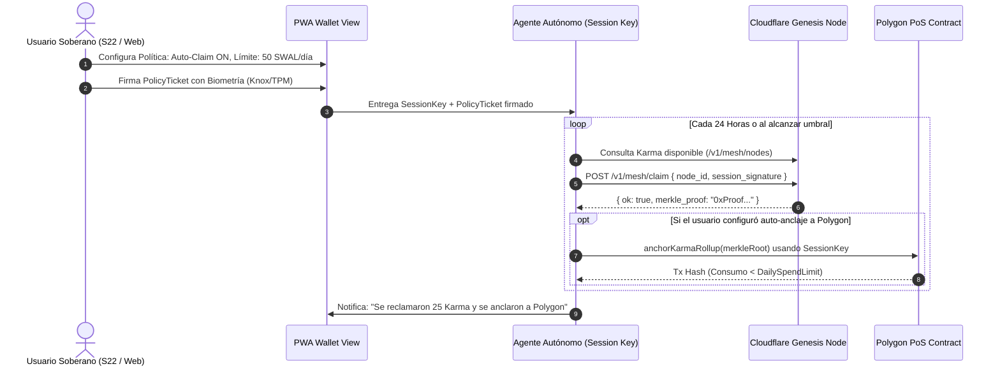

# SWAL Sovereign Wallet & Autonomous Agent Session Key Delegation Specification
**Document ID:** SWAL-RFC-0043  
**Status:** Canonical / Active  
**Author:** BELA + SWAL Core Architecture  
**Target:** AI Agents (Jules, Hermes, Antigravity) & Security Auditors  
**Date:** 2026-09-12  

---

## 1. Architectural Tesis: El Modelo de Dos Capas

La soberanía de datos y la economía descentralizada en SWAL resuelven el dilema fundamental de las Web3 DApps: **costo de gas y lentitud vs. centralización**.

```
+=========================================================================+
| CAPA 0: MESH SOBERANO LOCAL-FIRST (OFF-CHAIN)                           |
|-------------------------------------------------------------------------|
|  - Entorno: PWA en navegador, Samsung S22 (Knox), daemon de Linux       |
|  - Unidad contable: Karma / XP (Xavier Points)                          |
|  - Mecanismo de Consenso: Proof of Availability (PoA) via Heartbeats   |
|  - Costo de transacción: $0.00 (Zero Gas)                               |
|  - Latencia: < 50ms (Validación WebCrypto / Rust local)                 |
|  - Custodia: Par Ed25519 local sellado en Enclave / LocalStorage        |
+=========================================================================+
                                    |
                                    | Checkpoints Periódicos
                                    | (Merkle Rollup Roots)
                                    v
+=========================================================================+
| CAPA 1: BLOCKCHAIN POLYGON PoS (ON-CHAIN)                               |
|-------------------------------------------------------------------------|
|  - Smart Contracts: ISwalIdentityRegistry & SWAL ERC-20 Token           |
|  - Función: Liquidación, gobernanza DAO, transferencias a terceros      |
|  - Costo de gas: Pagado en POL / MATIC                                  |
|  - Interacción: Solo requerida cuando el usuario desea "Cash-Out"       |
+=========================================================================+
```

### Regla Canónica de Transición
1. **Un usuario NO necesita una billetera cripto externa para empezar.** Al abrir la PWA, su dispositivo se convierte automáticamente en un nodo soberano con un par de claves Ed25519 y comienza a acumular Karma.
2. **La transición a Capa 1 ocurre solo por voluntad del usuario:** cuando decide retirar sus tokens a Polygon o votar en la DAO.

---

## 2. Delegación Autónoma al Agente: Session Keys y Account Abstraction

Un usuario soberano desea que su agente de IA (Hermes, Antigravity, etc.) gestione tokens, reclame Karma automáticamente y ejecute tareas en su nombre, **sin que el agente tenga acceso a la llave privada maestra**.

### 2.1 Principio de Privilegio Mínimo (Principle of Least Privilege)
- **Master Owner Key (Nivel 0 - Inmutable):**
  - Reside en el chip físico (Knox Vault en Android S22, TPM 2.0 en Linux).
  - Solo se activa mediante autorización biométrica o PIN.
  - Es la **única** con poder para revocar agentes, cambiar políticas o retirar el 100% de los fondos.
- **Agent Session Key (Nivel 1 - Efímera y Restringida):**
  - Generada por el agente o el runtime local (clave Ed25519 o secp256k1 temporal).
  - Autorizada por la Master Key con una **Declaración de Política Criptográfica (Delegation Policy Ticket)**.

### 2.2 Estructura del Ticket de Delegación

$$\text{PolicyTicket} = \{ \text{AgentPubKey}, \text{NodeId}, \text{DailySpendingLimit}, \text{AllowedActions}, \text{ExpiresAt}, \text{Nonce} \}$$

```json
{
  "version": 1,
  "node_id": "node_ed0fe57d1f71cbf6",
  "agent_public_key": "0x39a1b2...",
  "permissions": {
    "can_claim_karma": true,
    "can_anchor_merkle": true,
    "can_transfer_tokens": true,
    "daily_spending_limit_swal": 50,
    "allowed_contract_targets": [
      "0xSwalIdentityRegistryPolygonAddress..."
    ]
  },
  "valid_from": 1789188000,
  "expires_at": 1789274400,
  "master_signature": "0xEd25519SignatureByKnoxEnclave..."
}
```

### 2.3 Garantías Criptográficas contra Agentes Maliciosos
1. **Límite de Gasto Diario (Daily Spend Cap):** Si el agente sufre una alucinación o es secuestrado por prompt injection, **jamás puede transferir más del límite diario configurado (ej. 50 SWAL)**.
2. **Incapacidad de Exfiltración:** El agente nunca lee la clave privada del usuario. Solo posee su propia clave de sesión efímera que expira en 24 horas.
3. **Revocación Instantánea en 1-Clic:** El usuario puede invalidar cualquier Session Key incrementando el `delegation_epoch` en el contrato o en el ledger local.

---

## 3. Flujo Operativo de Reclamación y Anclaje (Rollup)



---

## 4. Estado de Implementación en el Monorepo SWAL

| Capa | Componente | Archivo | Estado |
| :--- | :--- | :--- | :---: |
| **Capa 0 (Crypto)** | Keystore E2EE AES-GCM + Argon2id | [`apps/xavier/src/crypto/wallet.rs`](src/crypto/wallet.rs) | ✅ 100% Operativo |
| **Capa 0 (Tokenomics)**| Registro de XP, Balances y Staking | [`apps/xavier/src/mesh/tokenomics/wallet.rs`](src/mesh/tokenomics/wallet.rs) | ✅ 100% Operativo |
| **Capa 1 (Anchor)** | Broadcaster Polygon PoS via Alloy | [`apps/xavier/src/polygon_anchor/broadcast.rs`](src/polygon_anchor/broadcast.rs) | ✅ 100% Operativo |
| **PWA UI** | Billetera Soberana y Gestión de Agentes | `panel-ui/src/components/WalletView.tsx` | 🚀 Implementado |
| **CLI** | Comandos `xavier wallet balance` | `apps/xavier/src/cli/commands/wallet.rs` | 🚀 Implementado |
